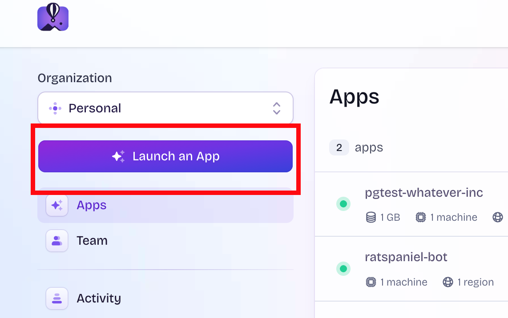
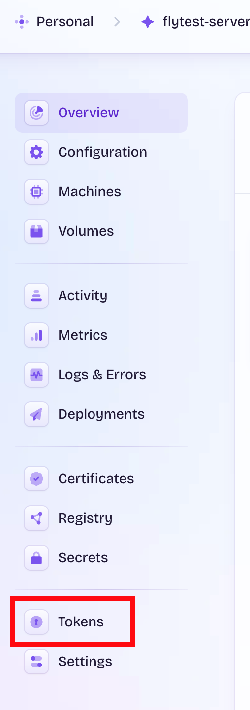
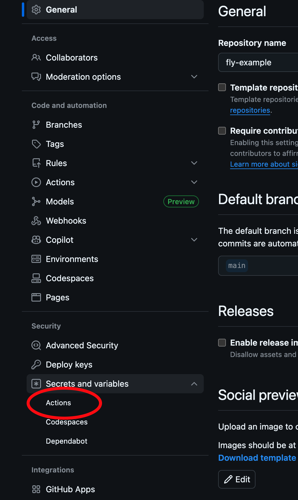

# Deploy to Fly.io

Copy the `.github/workflows` folder and `infra` folder to your own repository. Push these changes up.

Login to your fly.io account.

In the fly.io Dashboard, click "Launch an App"


Click `Select repository`

## Postgres

For any non-sensitive environment variables, those can be safely set under the `[env]` section in `fly-pg.toml`  
e.g.

```toml
[env]
  POSTGRES_USER = "admin"
  POSTGRES_DB = "my-database"
```

Also, let's give a _very_ unique name to the `app` field in `fly-pg.toml` (this is a globally unique name across accounts)

Now launch your brand new Postgres app  
`fly launch -c infra/fly-pg.toml`

Fly likes to give you 2 machines by default, this is overkill, let's scale it back to 1.  
`fly scale count 1 -c infra/fly-pg.toml`

Postgres requires some sort of persistent data storage. We'll use fly.io volumes to do that, these will mount directly into your container.
Create a volume: `fly volumes create pgdata -c infra/fly-pg.toml`

Postgres will probably fail on first launch, that's because it still needs 1 required secret.  
At a bare minimum, Postgres requires a `POSTGRES_PASSWORD` environment variable which has your superuser password.  
Because this is sensitive, this needs to be created as a secret in fly.io.  
`fly secrets set POSTGRES_PASSWORD=verysecret -c infra/fly-pg.toml`

## Automating the deploy

In your Postgres app, find the `Tokens` menu item


Create a new token, and copy this to your clipboard.

Then go into your Github repo settings, find the `Secrets and variables` section, and click on `Actions`  


Click `new repository secret`  
Give your new secret a name of `FLY_API_TOKEN_PG` (this is what deploy-pg.yml is looking at, you can call it anything as long as they're the same). Paste your fly.io token in there and click `Add secret`

## Server + Web Client

Most of the above steps can be repeated for the server and the web client.
You probably don't need a persistent volume for any of them, and you probably won't have any secrets for the web client.

Create a `fly-server.toml` and `Dockerfile-server` for your server, and a `fly-web.toml` and `Dockerfile-web` for your web client. I already have scaffolding in here but you'll want to override with your specific Dockerfiles for your applications.

Give super unique names to the `app` entry in each toml file!

The general flow is to `fly launch ...` them, then `fly scale ...`, and for any secrets run `fly secrets ...`

Take an inventory of what kind of environment variables and secrets you need for your server/web client.  
Non-secret environment variables can by set in plain text in the `fly-***.toml` files.

For automatic deployment for the web, you will also need to add your own `deploy-web.yml` file, I have deploy yml files already for the database and the server as scaffolding.

## How are these networking together?

Fly allows for internal dns access to other applications.  
The example server in this repo connects to Postgres via it's fly app name with `.internal` appended. E.g. `pgtest-whatever-inc.internal`

This is currently set in the `fly-server.toml` file, yours will be different as you will have a unique app name. The hostname will follow the pattern of `<appname>.internal`

The server and the web will be exposed via HTTPS automatically by fly.io. This is what the `[http_service]` section is doing in each of those toml files, so we immediately get a public domain name to connect them.  
Your web layer will need to reference whatever domain is assigned to your server. Generally it will be in the form of `https://<appname>.fly.dev`

For this example server, it is `https://flytest-server-whatever-inc.fly.dev`
